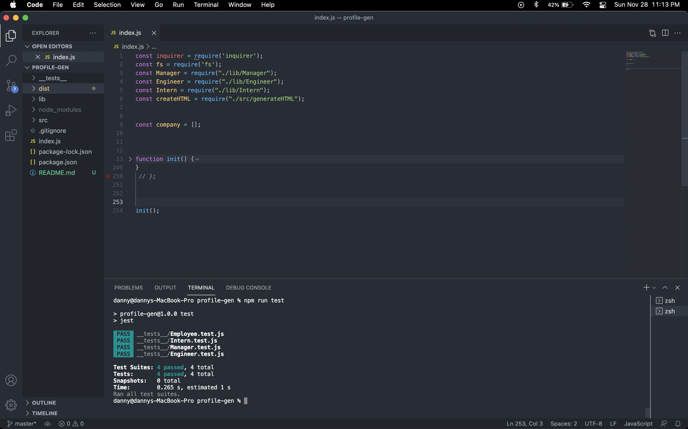

# Team Profile Generator

## About this program

Team Profile generator is a command line application using node.js which prompts questions about team positions and once filled generates an html file with cards for every employee added through the command line.

## Installation
npm install package

## Contributing
Hector Perez

## Built with

* Javascript
* node.js
* HTML
* CSS

### Questions
Contact me:

[Github](https://www.github.com/hpere102)  
[Email](mailto:hpere102@fiu.edu)